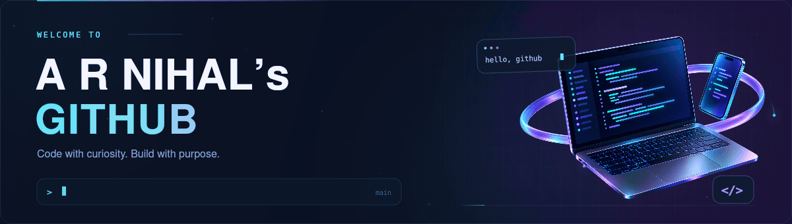

<div align="center">
  
</div>

<h1 align="center">
  Hi , I am Ashikur Rahman Nihal
</h1>

## 👨‍💻 About Me

```json
{
  "name": "Ashikur Rahman Nihal",
  "role": "Mobile Application Developer",
  "location": "Dhaka, Bangladesh",
  "Education": [
    "Self Taught Flutter Developer",
    "Bachelor of Science in Computer Science and Engineering"
  ],
  "specialization": [
    "Cross-Platform Development (Flutter)",
    "Native Android Development (Kotlin)",
    "Clean Architecture & MVVM",
    "Performance-Focused UI"
  ],
  "currently_working_on": [
    "Thesis Project: [Add 1 line topic]",
    "Building scalable Flutter apps with modern state management"
  ],
  "interests": [
    "Mobile System Design",
    "App Performance Optimization",
    "UI/UX Engineering",
    "Real-world Production Applications"
  ]
}
```
<p align="center">
  
</p>

##  Skills


#### 📱 Mobile App Development

- 
  
  
  

#### ⛏️ Programming & Backend

- 
  
  
  
  

#### 🛠️ IDEs & Development Tools

- 
  

#### ☁️ Cloud, VPS & Server Management

- 
  
  
- 
  

#### 🚦 Version Control & Design

- 
  
  

<br clear="both" />

<p align="center">
  
</p>

## 📊 GitHub Activity

<div align="center">


<br/><br/>


</div>

<br/>

---

<div align="center">

### Let's Connect

Interested in mobile development, clean architecture,
or building better applications?

I'm always open to connecting with fellow developers
and exchanging ideas.

<br/>

<a href="https://linkedin.com/in/arnihal">
  
</a>
&nbsp;
<a href="mailto:arnihal.cs@gmail.com">
  
</a>

<br/><br/>

<sub>Built with intention. Focused on simplicity and engineering.</sub>

</div>

<div align="center">
  
</div>
